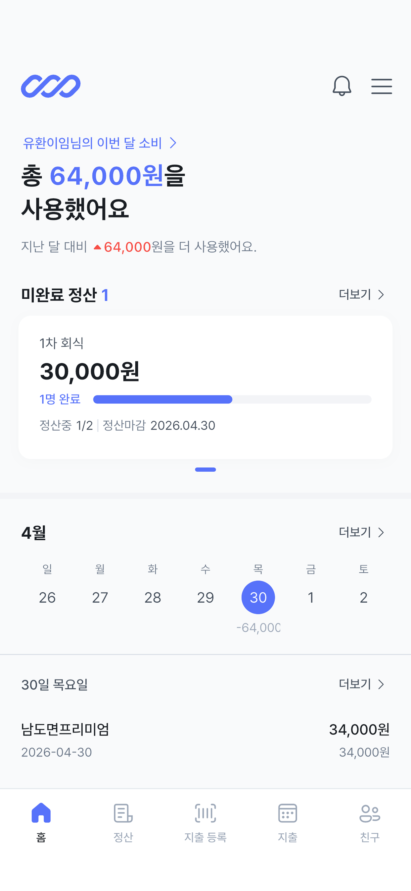
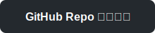
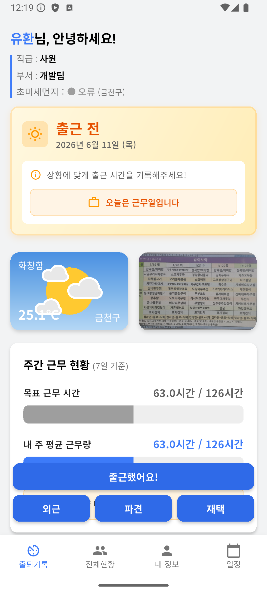

# 👋 안녕하세요, 모바일 개발자 정유환입니다.

Flutter(Dart)를 중심으로 모바일 앱을 개발하고 있습니다. 
실무에서는 Android, SwiftUI, React Native 등 다양한 플랫폼을 경험하며 폭넓은 시야를 쌓아왔습니다.

  
  

  

## 🛠 기술 스택
### 💻 언어 & 프레임워크
| 구분 | 기술 |
|:---|:---|
| **플랫폼** |     |
| **언어** |     |
| **아키텍처** | 🏛️ MVVM ・ 🧱 Clean Architecture |
| **협업** |      |

## 🚀 프로젝트

<table>
<tr>
<td width="300" align="center"></td>
<td rowspan="2">

**버려지는 영수증을 효율적으로 활용하기 위한 가계부 앱**

ML Kit으로 영수증 이미지를 1차 인식한 뒤 서버 AI로 카테고리를 자동 분류해, 직접 입력 없이 지출 내역을 빠르게 정리할 수 있습니다. 정산, 캘린더 뷰, 소셜 로그인 등 소비 관리에 필요한 기능도 함께 제공합니다.

`📅 2026.02 ~ 2026.05` `👥 모바일 1 · 서버 1 · 디자이너 1` `📱 iOS / Android`

**담당 역할**
- Flutter 앱 전체 개발 (iOS / Android)
- Clean Architecture 기반 프로젝트 구조 설계
- ML Kit OCR 영수증 인식 기능 구현
- 소셜 로그인 (Google / Kakao / Naver / Apple) 연동
- App Store 배포

**주요 기능**
- 영수증 OCR 자동 인식 — 촬영 한 번으로 금액·장소·날짜 자동 추출
- 카테고리 자동 분류 — 식비·교통·카페 등 지출 성격에 맞게 자동 태깅
- 지출 정산 — 개인/정산 지출 구분 등록, 팀원별 정산 금액 자동 계산
- 친구 추가 및 관리 — 정산을 함께하는 친구 등록 및 관리
- 캘린더 지출 뷰 — 날짜별 소비 금액을 달력에 표시, 오늘의 지출 실시간 확인
- 소셜 로그인 — Google · Kakao · Naver · Apple 지원

**Tech Stack**

 

</td>
</tr>
<tr>
<td width="300" align="center">

### 정직

</td>
</tr>
</table>

<table>
<tr>
<td width="300" align="center"></td>
<td rowspan="2">

**웹으로만 제공되던 사내 출결 시스템을 앱으로 리뉴얼한 프로젝트**

메일 링크로 출결을 처리해야 했던 기존 방식이 불편하다는 의견에서 시작해, 같은 기능을 앱으로 옮기면 더 편리할 것이라 생각해 자발적으로 기획하고 개발했습니다. 기존 API를 그대로 활용하면서 디자인과 사용자 경험에 집중해 출결 과정이 더 직관적이고 부드럽게 느껴지도록 애니메이션 구현에 많은 시도를 담았습니다. 완성된 앱은 TestFlight와 APK로 배포해 사내 동료들이 실제로 사용할 수 있도록 공유했습니다.

`📅 2025.10 ~ 2025.12` `👥 모바일 1 (본인) · 서버 1` `📱 iOS / Android` `📦 TestFlight · APK 사내배포`

**담당 역할**
- Flutter 앱 전체 개발 (iOS / Android)
- Clean Architecture 기반 프로젝트 구조 설계
- 출근·퇴근·근무지 변경·휴가/연차 사용·개인정보 확인 등 핵심 UI 개발
- 날씨 API 연동을 통한 날씨 기반 UI 변경 기능 구현
- 웹 크롤링을 통한 구내식당 메뉴판 정보 제공 기능 구현
- 화면 전환 및 인터랙션 애니메이션 구현
- TestFlight(iOS) 및 APK(Android) 사내 배포

**주요 기능**
- 출근 · 퇴근 — 버튼 한 번으로 출퇴근 기록, 상태에 따라 화면 UI 자연스럽게 전환
- 근무지 변경 — 사무실·외근·재택 등 근무지를 간단히 선택해 변경
- 휴가 · 연차 사용 — 휴가/연차 신청 및 사용 현황 확인
- 날씨 기반 UI — 날씨 API 연동으로 현재 날씨에 맞춰 메인 화면 분위기와 UI 변경
- 구내식당 메뉴 안내 — 웹 크롤링으로 당일 구내식당 메뉴 한눈에 확인
- 개인정보 확인 — 소속·직급·근무 이력 등 개인 정보 앱에서 바로 확인

**Tech Stack**

 

</td>
</tr>
<tr>
<td width="300" align="center">

### 출결이

</td>
</tr>
</table>

<table>
<tr>
<td width="300" align="center"></td>
<td rowspan="2">

**흩어져 있던 학교 생활 앱들을 하나로 통합한 팀 프로젝트**

학교 커뮤니티는 에브리타임, 출석은 별도 앱, 학사 정보는 학교 앱, 스터디룸 예약은 또 다른 앱으로 나뉘어 있어 매번 여러 앱을 오가야 했던 불편함에서 출발했습니다. 여기서 더 나아가 출석이나 활동 등 학교생활을 통해 포인트를 적립하고 교내 상점에서 사용할 수 있게 함으로써 자연스럽게 학교생활 참여 동기를 부여하는 구조를 더했습니다. 졸업작품전에서 최우수상을 수상했습니다.

`📅 2024.06 ~ 2024.12` `👥 팀장 1 (본인) · 팀원 2` `📱 iOS / Android` `🏆 졸업작품전 최우수상`

**담당 역할**
- React Native 앱 전체 개발 (iOS / Android)
- 프로젝트 구조 설계 및 팀 리딩
- QR 출석, 시간표 관리, 스터디룸 예약 등 핵심 UI 개발
- Firebase Auth / Firestore 기반 인증 및 실시간 데이터 연동
- Lottie · Reanimated 기반 화면 전환 및 인터랙션 애니메이션 구현
- Express + MariaDB 서버 구축 및 API 연동
- 관리자 기능(포인트·경고·권한 부여, 공지·이벤트·상품 관리) 개발

**주요 기능**
- QR 출석 — QR코드 스캔으로 간편하게 출석 처리
- 시간표 관리 — 시간표 직접 수정 및 일정 추가
- 스터디룸 예약 — 원하는 시간에 스터디룸 예약 및 이용
- 동아리 · 공모전 신청 — 앱에서 바로 가입 신청 및 참가
- 커뮤니티 · 공지사항 — 게시글·댓글·대댓글로 소통
- 이벤트 · 포인트 상점 — 이벤트 참여로 포인트 적립 후 상점 이용
- 관리자 기능 — 포인트·경고·권한 부여 및 운영 전반 관리

**Tech Stack**

    

</td>
</tr>
<tr>
<td width="300" align="center">

### Campus Life

</td>
</tr>
</table>
